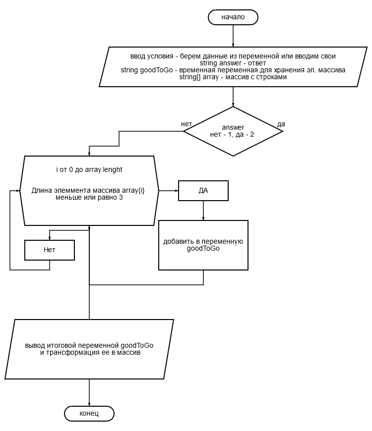

<h1> Решение простое </h1>

**1)** Берем массив строк - каждый элемент массива проверяем на длину (к-во символов)

**2)** Если Символов <= 3 добавляем этот элемент к переменной строке

**3)** В конце цикла перебора элементов массива, разбиваем строка на элементы массива по символу-разделителю

